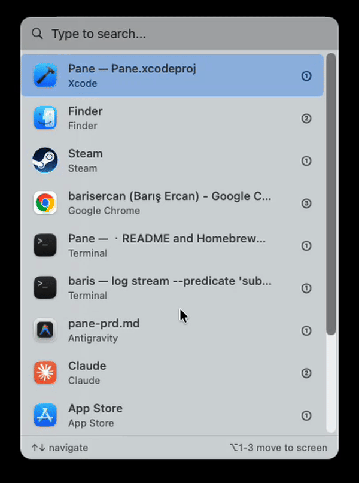

# Pane

A fast, keyboard-driven window switcher for macOS. Activate with double-tap ⌘.




## Features

- **Double-tap ⌘ to activate** - Quick access without breaking your flow
- **Instant search** - Type to filter windows by app name or title
- **Keyboard navigation** - Arrow keys to navigate, Enter to switch
- **Multi-monitor support** - Move windows between screens with ⌥+1/2/3
- **Native macOS UI** - Vibrancy effect, feels right at home

## Installation

### Homebrew

```bash
brew install --cask barisercan/tap/pane
```

### Manual

1. Download the latest release from [Releases](https://github.com/barisercan/Pane/releases)
2. Move `Pane.app` to `/Applications`
3. Launch Pane
4. Grant Accessibility permission when prompted

## Usage

| Action | Shortcut |
|--------|----------|
| Open/close Pane | Double-tap ⌘ |
| Navigate list | ↑ / ↓ |
| Switch to window | Enter |
| Search windows | Type letters |
| Clear search | Escape |
| Close Pane | Escape (when search is empty) |
| Move window to screen | ⌥ + 1/2/3 |

## Permissions

Pane requires **Accessibility** permission to:
- Detect the double-tap ⌘ hotkey
- Enumerate and control windows

Grant access in **System Settings → Privacy & Security → Accessibility**.

## Building from Source

```bash
git clone https://github.com/barisercan/Pane.git
cd Pane
xcodebuild -scheme Pane -configuration Release build
```

The built app will be in `build/Release/Pane.app`.

## Requirements

- macOS 14.0 (Sonoma) or later
- Accessibility permission

## License

MIT License - see [LICENSE](LICENSE) for details.
